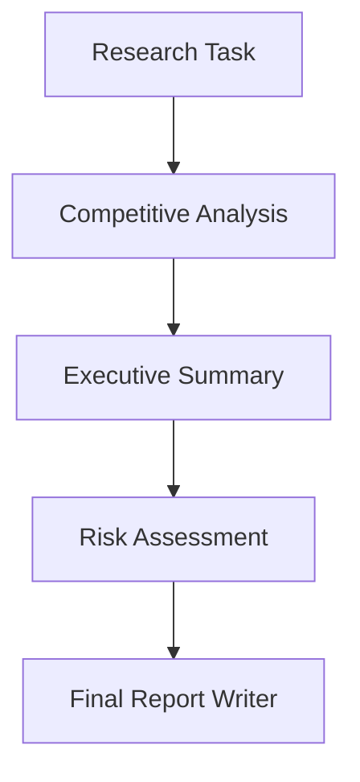
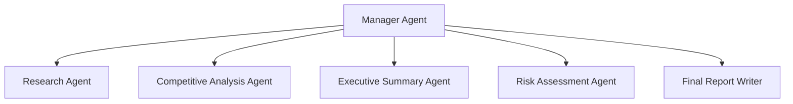

# research-orchestrator *^____^*

A simple multi-agent research system built with CrewAI.

This project explores two orchestration styles:

* **Sequential process**
* **Hierarchical process**

This is purely a learning project. Nothing production-grade. Just experimentation to understand how multi-agent systems behave under different orchestration patterns.

---

## 🚀 What This Project Does

The system simulates a research workflow using multiple agents:

* Research agent
* Competitive analysis agent
* Executive summary agent
* Risk assessment agent
* Final report writer

It runs the same research goal using two different orchestration styles to compare behavior.

---

## 🧠 Process Types Implemented

### 1️⃣ Sequential Process

Tasks execute in a fixed order.

* Deterministic
* Predictable token usage
* Lower coordination overhead
* Better suited for this research workflow

For this project, **sequential works better** because:

* Tasks are clearly defined
* Dependencies are linear
* No dynamic delegation is required

---

### Sequential Flow Structure



---

### 2️⃣ Hierarchical Process

A manager agent oversees the system and delegates tasks dynamically.

* Manager reviews outputs
* Can reassign tasks
* Can revise work
* Higher token usage
* More flexible but more complex

In this project, hierarchical mode consumed more tokens because:

* The manager delegates step-by-step
* Each delegation triggers additional reasoning
* Extra coordination overhead is introduced

---

### Hierarchical Flow Structure



Manager supervises and coordinates all agents instead of relying on a fixed execution chain.

---

## 📁 Project Structure

```
research-orchestrator/
│
├── reseacher_hierarchical # hierarchical workflow
├── researcher_sequential  #sequential workflow
└── README.md
```

---

## ⚙️ Key Learnings

* Multi-agent systems introduce coordination cost.
* More autonomy ≠ better performance.
* Clear task boundaries matter more than adding agents.
* Sequential orchestration is often sufficient for structured research workflows.
* Hierarchical mode is powerful but token-expensive.

---

## 🎯 Purpose

This repository exists to:

* Understand CrewAI orchestration patterns
* Compare sequential vs hierarchical execution
* Explore multi-agent coordination tradeoffs

This is a learning sandbox — not a production framework.

---

## 🔍 Conclusion

For structured research pipelines:

Sequential orchestration is simpler, faster, and more predictable.

Hierarchical orchestration is useful when:

* Tasks are ambiguous
* Dynamic delegation is required
* Quality control must be autonomous

For this specific research workflow, sequential mode is the better architectural choice.

bie bie ㄟ(≧◇≦)ㄏ

---

If you’d like, I can also add a small comparison table section to make it more portfolio-ready.
