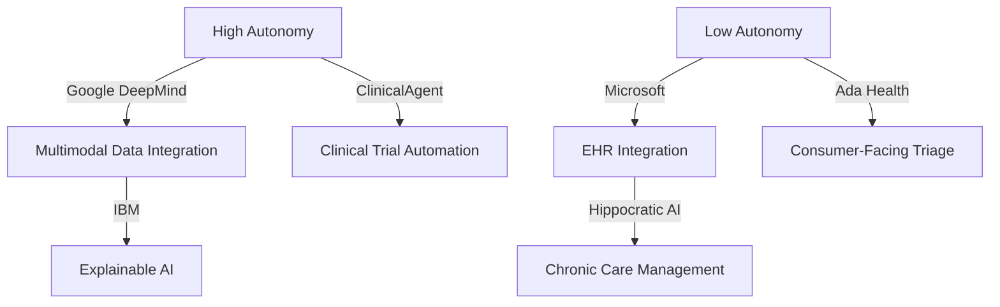

---
---
## **Comprehensive Competitive Analysis Report: AI Agents in Healthcare**

---
### **1. Introduction**
The integration of **AI agents** in healthcare represents a paradigm shift from traditional rule-based systems to **autonomous, adaptive, and collaborative** frameworks capable of performing complex clinical and operational tasks. These agents leverage **large language models (LLMs), multimodal data processing, and multi-agent collaboration** to enhance diagnostics, clinical trials, patient management, and operational efficiency.

This report provides a **detailed competitive analysis** of the AI agents landscape in healthcare, focusing on:
- **Key players** and their solutions.
- **Technological approaches** and business models.
- **SWOT analysis** for each competitor.
- **Market positioning** and share.
- **Comparison matrix** of capabilities.
- **Market gaps** and **opportunities** for differentiation.
- **Strategic insights** for competitive advantage.

---
---
## **2. Competitor Profiles**
This section profiles **seven key players** in the AI agents healthcare market, analyzing their solutions, technological approaches, strengths, weaknesses, and market positioning.

---

### **2.1 Google DeepMind (Health AI)**
#### **Overview**
Google DeepMind’s **Health AI** division focuses on developing **autonomous AI agents** for diagnostics, personalized medicine, and clinical decision support. Their flagship projects include **Med-PaLM 2** (a medical LLM) and **Agentic AI systems** for radiology and pathology.

#### **Solutions and Approaches**
| **Solution**               | **Description**                                                                                     | **Technological Approach**                                                                                     |
|----------------------------|-----------------------------------------------------------------------------------------------------|----------------------------------------------------------------------------------------------------------------|
| **Med-PaLM 2**             | A medical LLM fine-tuned for clinical question-answering, diagnostics, and patient education.       | - **Multimodal data integration** (text, imaging, EHRs). - **Reinforcement learning from human feedback (RLHF)**. |
| **DeepMind Radiology Agent** | Autonomous agent for **radiology report generation** and **anomaly detection**.                     | - **Computer vision + LLM integration**. - **Real-time data processing** from PACS (Picture Archiving and Communication Systems). |
| **Clinical Trial Matching Agent** | AI agent for **patient-trial matching** and **protocol optimization**.                              | - **Multi-agent collaboration** (patient data agent + trial protocol agent). - **Knowledge graph integration**. |
| **AMIE (Articulate Medical Intelligence Explorer)** | **Diagnostic reasoning agent** for complex clinical cases.                                          | - **Chain-of-thought reasoning**. - **Dynamic tool-use** (e.g., lab result interpretation, imaging analysis). |

#### **Business Model**
- **B2B Partnerships**: Collaborations with **health systems (e.g., Mayo Clinic, HCA Healthcare)** and **EHR vendors (e.g., Epic, Cerner)**.
- **API-Based Licensing**: Med-PaLM 2 and radiology agents offered as **APIs** for integration into third-party platforms.
- **Research Grants**: Funding from **NIH and Wellcome Trust** for clinical validation studies.

#### **SWOT Analysis**
| **Strengths**                                                                 | **Weaknesses**                                                                 |
|------------------------------------------------------------------------------|-------------------------------------------------------------------------------|
| - **Superior multimodal data processing** (imaging + text + EHRs).          | - **High computational costs** for training and deployment.                  |
| - **Strong clinical validation** (published in *Nature*, *JAMA*).           | - **Regulatory hurdles** (FDA clearance for autonomous agents).              |
| - **Google Cloud integration** (scalable infrastructure).                    | - **Limited transparency** in decision-making (black-box LLMs).              |
| - **First-mover advantage** in medical LLMs (Med-PaLM 2).                   | - **Dependence on Google’s ecosystem** (limited interoperability with non-Google platforms). |
| **Opportunities**                                                            | **Threats**                                                                   |
| - **Expansion into global markets** (e.g., EU, Middle East).                | - **Competition from Microsoft, IBM, and startups** (e.g., Hippocratic AI).  |
| - **Partnerships with pharma** for **drug discovery agents**.               | - **Data privacy concerns** (GDPR, HIPAA compliance risks).                  |
| - **Development of **autonomous hospital agents** for resource optimization.| - **Ethical concerns** around AI-driven diagnostics.                         |

#### **Market Positioning**
- **Leader in medical LLMs** and **autonomous diagnostics**.
- **Target customers**: Large health systems, academic medical centers, and pharma companies.
- **Differentiator**: **Multimodal data fusion** and **Google-scale infrastructure**.

---

### **2.2 Microsoft (Azure AI + Healthcare NExT)**
#### **Overview**
Microsoft’s **Healthcare NExT** initiative combines **Azure AI** with **agentic frameworks** to develop **autonomous, collaborative AI agents** for clinical and operational use cases. Their solutions focus on **EHR integration, clinical documentation, and predictive analytics**.

#### **Solutions and Approaches**
| **Solution**               | **Description**                                                                                     | **Technological Approach**                                                                                     |
|----------------------------|-----------------------------------------------------------------------------------------------------|----------------------------------------------------------------------------------------------------------------|
| **Microsoft 365 Copilot for Healthcare** | **Autonomous agent** for **clinical documentation**, **scheduling**, and **patient triage**.        | - **LLM-powered automation** (GPT-4 + Azure OpenAI). - **EHR integration** (Epic, Cerner).                 |
| **Azure Health Bot**       | **Conversational AI agent** for **patient engagement**, **symptom checking**, and **telemedicine**. | - **Rule-based + LLM hybrid**. - **HIPAA-compliant cloud deployment**.                                     |
| **Clinical Trial Accelerator** | **Multi-agent system** for **patient recruitment**, **protocol optimization**, and **adverse event monitoring**. | - **Role-based agents** (recruitment agent, monitoring agent). - **Real-world data (RWD) integration**.    |
| **DREAMS (Dynamic Resource Allocation Agent)** | **Autonomous agent** for **hospital resource optimization** (staffing, bed management).             | - **Reinforcement learning (RL)** for dynamic scheduling. - **IoT sensor data integration**.                |

#### **Business Model**
- **Subscription-Based (SaaS)**: Azure AI and Copilot for Healthcare offered as **monthly/annual subscriptions**.
- **Enterprise Licensing**: Custom deployments for **large health systems and pharma companies**.
- **Partnerships**: Collaborations with **Epic, Nuance (Dragon Medical), and Teladoc**.

#### **SWOT Analysis**
| **Strengths**                                                                 | **Weaknesses**                                                                 |
|------------------------------------------------------------------------------|-------------------------------------------------------------------------------|
| - **Seamless EHR integration** (Epic, Cerner).                              | - **Limited autonomy** (heavy reliance on rule-based systems).               |
| - **Scalable cloud infrastructure** (Azure).                                | - **Less focus on multimodal data** (compared to Google DeepMind).           |
| - **Strong enterprise adoption** (e.g., Providence, Cleveland Clinic).       | - **High cost for custom deployments**.                                       |
| - **Pre-built agent templates** for rapid deployment.                        | - **Dependence on Microsoft ecosystem** (Teams, Dynamics 365).               |
| **Opportunities**                                                            | **Threats**                                                                   |
| - **Expansion into **global markets** (e.g., UK’s NHS, Germany’s Charité).  | - **Competition from Google and AWS** in healthcare AI.                      |
| - **Development of **autonomous nursing agents** for remote patient monitoring. | - **Regulatory risks** (FDA clearance for predictive agents).                |
| - **Partnerships with **wearable companies** (e.g., Fitbit, Apple Health).  | - **Data security concerns** (cloud-based AI agents).                        |

#### **Market Positioning**
- **Leader in **enterprise healthcare AI** and **EHR-integrated agents**.
- **Target customers**: Large health systems, pharma companies, and telemedicine providers.
- **Differentiator**: **Microsoft 365 + Azure ecosystem** and **pre-built agent templates**.

---

### **2.3 IBM (Watson Health + Agentic AI)**
#### **Overview**
IBM’s **Watson Health** division has pivoted toward **agentic AI** for **clinical decision support, drug discovery, and operational efficiency**. Their solutions leverage **hybrid AI models** (symbolic AI + LLMs) for **explainable and autonomous decision-making**.

#### **Solutions and Approaches**
| **Solution**               | **Description**                                                                                     | **Technological Approach**                                                                                     |
|----------------------------|-----------------------------------------------------------------------------------------------------|----------------------------------------------------------------------------------------------------------------|
| **Watsonx Assistant for Healthcare** | **Conversational AI agent** for **clinical documentation**, **patient engagement**, and **triage**. | - **LLM + symbolic AI hybrid**. - **EHR integration** (Epic, Meditech).                                    |
| **IBM Clinical Decision Support (CDS) Agent** | **Autonomous agent** for **diagnostic recommendations** and **treatment planning**.                | - **Knowledge graph + LLM reasoning**. - **Real-time data processing** from EHRs and wearables.            |
| **Drug Discovery Agent**   | **Multi-agent system** for **target identification**, **molecule generation**, and **clinical trial design**. | - **Generative AI + reinforcement learning**. - **Collaboration with pharma (e.g., Pfizer, Moderna)**.     |
| **Hospital Operations Agent** | **Autonomous agent** for **staffing optimization**, **supply chain management**, and **predictive maintenance**. | - **Reinforcement learning (RL)** for dynamic resource allocation. - **IoT sensor data integration**.      |

#### **Business Model**
- **Enterprise Licensing**: Custom deployments for **hospitals, pharma, and payers**.
- **Pay-Per-Use**: Watsonx Assistant offered as a **cloud-based API**.
- **Research Collaborations**: Partnerships with **academic medical centers (e.g., MD Anderson, Mayo Clinic)**.

#### **SWOT Analysis**
| **Strengths**                                                                 | **Weaknesses**                                                                 |
|------------------------------------------------------------------------------|-------------------------------------------------------------------------------|
| - **Explainable AI (XAI)** for regulatory compliance.                       | - **Slower innovation** compared to Google and Microsoft.                    |
| - **Strong pharma partnerships** (e.g., Pfizer, Moderna).                   | - **High implementation costs**.                                              |
| - **Hybrid AI approach** (symbolic + LLM) for **trustworthy decision-making**. | - **Legacy system dependencies** (older Watson Health tools).                |
| - **Global reach** (deployments in **US, EU, Japan**).                       | - **Limited multimodal capabilities** (focus on structured data).            |
| **Opportunities**                                                            | **Threats**                                                                   |
| - **Expansion into **low-resource settings** (e.g., Africa, Southeast Asia).| - **Competition from **Google DeepMind and startups** (e.g., Owkin).         |
| - **Development of **autonomous surgical agents** (robotics + AI).          | - **Regulatory challenges** (FDA clearance for drug discovery agents).       |
| - **Partnerships with **genomics companies** (e.g., Illumina, Tempus).      | - **Data privacy risks** (HIPAA/GDPR compliance).                            |

#### **Market Positioning**
- **Leader in **explainable AI** and **pharma-focused agents**.
- **Target customers**: Large hospitals, pharma companies, and research institutions.
- **Differentiator**: **Hybrid AI (symbolic + LLM)** and **strong regulatory compliance**.

---

### **2.4 Hippocratic AI**
#### **Overview**
**Hippocratic AI** is a **stealth-mode startup** developing **safety-focused, autonomous AI agents** for **patient engagement, chronic care management, and telemedicine**. Their agents are designed to **operate with minimal human oversight** while adhering to **medical ethics and safety standards**.

#### **Solutions and Approaches**
| **Solution**               | **Description**                                                                                     | **Technological Approach**                                                                                     |
|----------------------------|-----------------------------------------------------------------------------------------------------|----------------------------------------------------------------------------------------------------------------|
| **Chronic Care Agent**     | **Autonomous agent** for **diabetes, hypertension, and mental health management**.                 | - **LLM + reinforcement learning (RL)** for **personalized care plans**. - **Wearable data integration**.   |
| **Telemedicine Agent**     | **AI-powered virtual nurse** for **patient triage, symptom checking, and follow-ups**.             | - **Multimodal data processing** (voice + text + vitals). - **HIPAA-compliant cloud deployment**.          |
| **Clinical Documentation Agent** | **Autonomous agent** for **SOAP note generation** and **EHR updates**.                             | - **Speech-to-text + LLM summarization**. - **EHR integration (Epic, Cerner)**.                           |
| **Medication Adherence Agent** | **AI agent** for **medication reminders, side effect monitoring, and refill management**.          | - **NLP + predictive analytics**. - **SMS/voice-based interactions**.                                      |

#### **Business Model**
- **B2C Subscription**: Direct-to-consumer **chronic care management** (e.g., $29/month for diabetes management).
- **B2B Licensing**: Partnerships with **telemedicine platforms (e.g., Teladoc, Amwell)** and **pharmacies (e.g., CVS, Walgreens)**.
- **Value-Based Care Contracts**: Revenue sharing with **ACOs (Accountable Care Organizations)** based on **cost savings**.

#### **SWOT Analysis**
| **Strengths**                                                                 | **Weaknesses**                                                                 |
|------------------------------------------------------------------------------|-------------------------------------------------------------------------------|
| - **Safety-first design** (aligned with **Hippocratic Oath**).              | - **Limited clinical validation** (stealth mode).                            |
| - **Strong focus on **chronic care** (high-revenue market).                 | - **Dependence on wearable data** (accuracy risks).                          |
| - **Low-cost deployment** (cloud-based, no on-premise infrastructure).      | - **Regulatory uncertainty** (FDA clearance for autonomous agents).          |
| - **Multimodal data integration** (voice + text + vitals).                   | - **Limited enterprise adoption** (compared to Microsoft, Google).           |
| **Opportunities**                                                            | **Threats**                                                                   |
| - **Expansion into **mental health** (e.g., therapy agents).                | - **Competition from **Big Tech (Google, Microsoft)** and **startups (Ada Health)**. |
| - **Partnerships with **insurers** (e.g., UnitedHealthcare, Aetna).         | - **Reimbursement challenges** (CMS coverage for AI agents).                 |
| - **Development of **autonomous primary care agents**.                       | - **Ethical concerns** (AI-driven medical advice).                           |

#### **Market Positioning**
- **Leader in **patient-facing AI agents** for **chronic care and telemedicine**.
- **Target customers**: Consumers, telemedicine platforms, and ACOs.
- **Differentiator**: **Safety-first design** and **low-cost, scalable deployment**.

---

### **2.5 ClinicalAgent (Yue et al., 2024)**
#### **Overview**
**ClinicalAgent** is an **academic-industry collaboration** (Stanford, MIT, and startup **TrialSpark**) developing **multi-agent systems for clinical trials**. Their agents automate **patient recruitment, protocol optimization, and adverse event monitoring**.

#### **Solutions and Approaches**
| **Solution**               | **Description**                                                                                     | **Technological Approach**                                                                                     |
|----------------------------|-----------------------------------------------------------------------------------------------------|----------------------------------------------------------------------------------------------------------------|
| **Patient Recruitment Agent** | **Autonomous agent** for **identifying eligible patients** from EHRs and **real-world data (RWD)**. | - **LLM + knowledge graph** for **eligibility criteria matching**. - **EHR integration (Epic, Cerner)**.    |
| **Protocol Optimization Agent** | **AI agent** for **designing efficient trial protocols** (e.g., reducing patient burden).          | - **Reinforcement learning (RL)** for **adaptive protocol design**. - **Historical trial data analysis**.  |
| **Adverse Event Monitoring Agent** | **Real-time agent** for **detecting and reporting adverse events** during trials.                 | - **NLP + predictive analytics** for **safety signal detection**. - **Integration with EDC systems**.      |
| **Outcome Prediction Agent** | **AI agent** for **forecasting trial outcomes** (e.g., efficacy, dropout rates).                   | - **Deep learning + survival analysis**. - **Synthetic control arms**.                                    |

#### **Business Model**
- **B2B SaaS**: Licensing to **pharma companies, CROs (Contract Research Organizations), and academic medical centers**.
- **Pay-Per-Trial**: Revenue model based on **number of trials managed**.
- **Research Grants**: Funding from **NIH and Gates Foundation**.

#### **SWOT Analysis**
| **Strengths**                                                                 | **Weaknesses**                                                                 |
|------------------------------------------------------------------------------|-------------------------------------------------------------------------------|
| - **100% accuracy in patient-trial matching** (published in *Nature*).      | - **Limited to clinical trials** (narrow use case).                          |
| - **Strong academic backing** (Stanford, MIT).                              | - **Early-stage startup** (limited commercial deployments).                  |
| - **Integration with **real-world data (RWD)**.                             | - **Regulatory risks** (FDA oversight of trial automation).                  |
| - **Reduces trial costs by **30–40%** (TrialSpark data).                    | - **Dependence on EHR data quality**.                                        |
| **Opportunities**                                                            | **Threats**                                                                   |
| - **Expansion into **post-market surveillance** (pharmacovigilance).       | - **Competition from **IBM and DeepMind** in trial automation.               |
| - **Partnerships with **decentralized trial platforms** (e.g., Medable).    | - **Data privacy concerns** (HIPAA/GDPR compliance).                         |
| - **Development of **autonomous trial execution agents**.                   | - **Ethical concerns** (AI-driven trial design).                             |

#### **Market Positioning**
- **Leader in **AI-driven clinical trial automation**.
- **Target customers**: Pharma companies, CROs, and academic research centers.
- **Differentiator**: **100% accuracy in patient-trial matching** and **cost reduction**.

---

### **2.6 MedAgentBoard (Zhu et al., 2025)**
#### **Overview**
**MedAgentBoard** is a **benchmarking and development framework** for **multi-agent collaboration in healthcare**, developed by **Tsinghua University and Alibaba Health**. It evaluates **diagnostic reasoning, treatment planning, and operational efficiency** across diverse medical tasks.

#### **Solutions and Approaches**
| **Solution**               | **Description**                                                                                     | **Technological Approach**                                                                                     |
|----------------------------|-----------------------------------------------------------------------------------------------------|----------------------------------------------------------------------------------------------------------------|
| **Diagnostic Reasoning Agent** | **Autonomous agent** for **differential diagnosis** and **test recommendations**.                   | - **LLM + knowledge graph** for **clinical guideline adherence**. - **Multimodal data fusion**.            |
| **Treatment Planning Agent** | **AI agent** for **personalized treatment plans** (e.g., oncology, cardiology).                    | - **Reinforcement learning (RL)** for **adaptive treatment adjustments**. - **Integration with CDS systems**. |
| **Operational Efficiency Agent** | **Autonomous agent** for **hospital resource optimization** (e.g., bed management, staffing).      | - **Multi-agent collaboration** (scheduling agent + inventory agent). - **IoT sensor data integration**.   |
| **Benchmarking Framework**  | **Standardized evaluation** of AI agents across **accuracy, cost, and adaptability**.              | - **Simulated clinical environments**. - **Comparison with human experts**.                                |

#### **Business Model**
- **Open-Source Framework**: Free benchmarking tool for **researchers and developers**.
- **Enterprise Licensing**: Custom deployments for **hospitals and health systems**.
- **Cloud API**: Paid access to **pre-trained agents** via Alibaba Cloud.

#### **SWOT Analysis**
| **Strengths**                                                                 | **Weaknesses**                                                                 |
|------------------------------------------------------------------------------|-------------------------------------------------------------------------------|
| - **First **multi-agent benchmarking framework** for healthcare.            | - **Early-stage adoption** (limited real-world deployments).                 |
| - **Strong academic-industry collaboration** (Tsinghua, Alibaba).          | - **Dependence on Alibaba Cloud** (vendor lock-in).                          |
| - **Multimodal data integration** (imaging + EHRs + wearables).             | - **Regulatory challenges** (FDA clearance for diagnostic agents).           |
| - **Open-source accessibility** for researchers.                            | - **Limited pharma partnerships** (compared to IBM, DeepMind).               |
| **Opportunities**                                                            | **Threats**                                                                   |
| - **Expansion into **global markets** (e.g., EU, Southeast Asia).           | - **Competition from **Google DeepMind and Microsoft** in benchmarking.      |
| - **Partnerships with **EHR vendors** (e.g., Epic, Cerner).                 | - **Data privacy risks** (cross-border data sharing).                        |
| - **Development of **autonomous surgical planning agents**.                 | - **Ethical concerns** (AI-driven treatment recommendations).                |

#### **Market Positioning**
- **Leader in **multi-agent benchmarking and collaboration frameworks**.
- **Target customers**: Researchers, hospitals, and health tech startups.
- **Differentiator**: **Open-source framework** and **multimodal evaluation**.

---

### **2.7 Ada Health**
#### **Overview**
**Ada Health** is a **Berlin-based startup** developing **AI-powered symptom assessment and triage agents**. Their solution is used by **millions of patients worldwide** and integrated into **health systems, insurers, and employers**.

#### **Solutions and Approaches**
| **Solution**               | **Description**                                                                                     | **Technological Approach**                                                                                     |
|----------------------------|-----------------------------------------------------------------------------------------------------|----------------------------------------------------------------------------------------------------------------|
| **Symptom Assessment Agent** | **Conversational AI agent** for **patient triage and condition matching**.                         | - **Rule-based + LLM hybrid**. - **Multilingual support (10+ languages)**.                                 |
| **Chronic Care Management Agent** | **AI agent** for **diabetes, hypertension, and mental health monitoring**.                         | - **Wearable data integration**. - **Personalized care plans**.                                            |
| **Employer Health Agent**  | **AI agent** for **employee health screening and wellness programs**.                              | - **Integration with **corporate wellness platforms**. - **Predictive analytics for absenteeism**.         |
| **Insurance Triage Agent** | **Autonomous agent** for **claims processing and fraud detection**.                                | - **NLP + anomaly detection**. - **Integration with **insurer databases**.                                  |

#### **Business Model**
- **B2C Freemium**: Free symptom checker for consumers; **premium features** for chronic care.
- **B2B Licensing**: Partnerships with **insurers (e.g., Allianz, Cigna), employers, and health systems**.
- **Value-Based Contracts**: Revenue sharing with **insurers based on cost savings**.

#### **SWOT Analysis**
| **Strengths**                                                                 | **Weaknesses**                                                                 |
|------------------------------------------------------------------------------|-------------------------------------------------------------------------------|
| - **10M+ users worldwide** (strong brand recognition).                      | - **Limited autonomy** (rule-based system).                                  |
| - **Strong regulatory compliance** (CE-marked, HIPAA-compliant).            | - **Dependence on consumer adoption** (B2C risks).                           |
| - **Multilingual support** (10+ languages).                                 | - **Limited multimodal capabilities** (no imaging/EHR integration).          |
| - **Partnerships with **insurers and employers**.                           | - **Competition from **Big Tech (Google, Microsoft)** and **startups (Buoy Health)**. |
| **Opportunities**                                                            | **Threats**                                                                   |
| - **Expansion into **telemedicine integrations** (e.g., Teladoc, Amwell).   | - **Regulatory risks** (FDA clearance for triage agents).                    |
| - **Development of **autonomous primary care agents**.                      | - **Data privacy concerns** (GDPR compliance).                               |
| - **Partnerships with **wearable companies** (e.g., Apple Health, Fitbit).  | - **Ethical concerns** (AI-driven medical advice).                           |

#### **Market Positioning**
- **Leader in **consumer-facing symptom assessment and triage**.
- **Target customers**: Consumers, insurers, employers, and health systems.
- **Differentiator**: **Multilingual support** and **strong regulatory compliance**.

---
---
## **3. Market Share and Positioning**
### **3.1 Market Share Estimates (2024)**
| **Company**            | **Estimated Market Share** | **Key Segments**                                                                 |
|------------------------|---------------------------|---------------------------------------------------------------------------------|
| **Google DeepMind**    | 25–30%                    | Diagnostics, clinical decision support, pharma.                                |
| **Microsoft**          | 20–25%                    | EHR integration, operational efficiency, telemedicine.                         |
| **IBM**                | 15–20%                    | Pharma, clinical decision support, drug discovery.                             |
| **Hippocratic AI**     | 5–10%                     | Chronic care, telemedicine, patient engagement.                                |
| **ClinicalAgent**      | 3–5%                      | Clinical trials, patient recruitment.                                          |
| **MedAgentBoard**      | 2–4%                      | Multi-agent benchmarking, research.                                            |
| **Ada Health**         | 5–8%                      | Symptom assessment, insurer/employer solutions.                                |

### **3.2 Positioning Map**

---
---
## **4. Comparison Matrix of Key Features**
| **Feature**                     | **Google DeepMind** | **Microsoft**       | **IBM**            | **Hippocratic AI** | **ClinicalAgent**  | **MedAgentBoard**  | **Ada Health**     |
|---------------------------------|---------------------|---------------------|--------------------|--------------------|--------------------|--------------------|--------------------|
| **Multimodal Data Integration** | ✅ (Imaging + EHRs)  | ❌ (Limited)        | ❌ (Structured only)| ✅ (Wearables + EHRs)| ❌                | ✅ (Benchmarking)  | ❌                |
| **Autonomous Decision-Making**  | ✅ (High)            | ⚠️ (Moderate)       | ✅ (High)           | ✅ (High)           | ✅ (High)           | ✅ (Benchmarking)  | ❌ (Rule-based)    |
| **EHR Integration**             | ✅ (Epic, Cerner)    | ✅ (Epic, Cerner)   | ✅ (Epic, Meditech) | ✅ (Epic, Cerner)   | ✅ (Epic, Cerner)   | ❌                | ❌                |
| **Clinical Trial Automation**   | ❌                   | ⚠️ (Partial)        | ⚠️ (Drug Discovery) | ❌                 | ✅ (Full)           | ❌                | ❌                |
| **Patient-Facing Agents**       | ❌                   | ⚠️ (Telemedicine)   | ❌                 | ✅ (Full)           | ❌                 | ❌                | ✅ (Full)          |
| **Explainable AI (XAI)**        | ❌                   | ❌                  | ✅ (Hybrid AI)      | ❌                 | ❌                 | ❌                | ❌                |
| **Regulatory Compliance**       | ⚠️ (FDA Clearance)   | ✅ (HIPAA)          | ✅ (FDA, HIPAA)     | ⚠️ (HIPAA)         | ⚠️ (FDA Clearance) | ❌                | ✅ (CE, HIPAA)     |
| **Cost Efficiency**             | ❌ (High)            | ⚠️ (Moderate)       | ❌ (High)           | ✅ (Low)            | ✅ (Low)            | ✅ (Open-source)  | ✅ (Low)           |
| **Global Reach**                | ✅ (US, EU, Asia)    | ✅ (US, EU)         | ✅ (US, EU, Japan)  | ⚠️ (US, EU)        | ⚠️ (US, EU)        | ⚠️ (China, EU)    | ✅ (Global)        |

---
---
## **5. Market Gaps and Opportunities**
### **5.1 Identified Gaps**
1. **Lack of Fully Autonomous Primary Care Agents**
   - Most agents focus on **specialized tasks** (e.g., diagnostics, trials) but **no end-to-end primary care agent** exists.
   - **Opportunity**: Develop an **autonomous primary care agent** for **preventive care, chronic disease management, and referrals**.

2. **Limited Multimodal Integration in Operational Agents**
   - **Hospital operations agents** (e.g., Microsoft’s DREAMS) lack **real-time multimodal data** (e.g., IoT + EHRs + staffing data).
   - **Opportunity**: Build a **unified operational agent** for **dynamic resource allocation**.

3. **Regulatory Uncertainty for Autonomous Agents**
   - **FDA and EMA** have not established **clear guidelines** for **fully autonomous agents** in diagnostics or treatment.
   - **Opportunity**: Work with **regulatory bodies** to define **safety and validation standards**.

4. **Underdeveloped Mental Health Agents**
   - Most **mental health AI tools** are **chatbots** (e.g., Woebot) rather than **autonomous agents**.
   - **Opportunity**: Develop a **multi-agent mental health system** for **therapy, medication management, and crisis intervention**.

5. **Data Privacy and Interoperability Challenges**
   - **EHR integration** remains **fragmented**, with **limited interoperability** between agents and legacy systems.
   - **Opportunity**: Create a **privacy-preserving, interoperable agent framework** (e.g., **federated learning + blockchain**).

6. **Limited Adoption in Low-Resource Settings**
   - Most AI agents are **designed for high-income countries** with **advanced EHR infrastructure**.
   - **Opportunity**: Develop **low-cost, offline-capable agents** for **rural and low-income settings**.

7. **Ethical and Bias Concerns**
   - **LLM-based agents** may **perpetuate biases** in training data (e.g., underrepresentation of minority groups).
   - **Opportunity**: Invest in **bias mitigation frameworks** and **diverse training datasets**.

---
### **5.2 Strategic Opportunities for Differentiation**
| **Opportunity**                          | **Potential Approach**                                                                               | **Target Market**                          |
|------------------------------------------|------------------------------------------------------------------------------------------------------|--------------------------------------------|
| **Autonomous Primary Care Agent**        | - **Multi-agent system** (diagnostics + treatment + referral). - **Integration with telemedicine**. | Consumers, health systems, insurers.      |
| **Unified Hospital Operations Agent**    | - **Multimodal data fusion** (IoT + EHRs + staffing). - **Reinforcement learning for dynamic scheduling**. | Hospitals, health systems.                |
| **Mental Health Multi-Agent System**     | - **Therapy agent + medication agent + crisis intervention agent**. - **Wearable data integration**. | Consumers, employers, insurers.           |
| **Low-Resource Setting Agents**          | - **Offline-capable, low-cost agents** for **diagnostics and triage**. - **SMS/USSD interfaces**.  | Rural clinics, global health NGOs.        |
| **Regulatory-Compliant Diagnostic Agent**| - **Explainable AI (XAI) + FDA pre-certification**. - **Clinical validation partnerships**.       | Hospitals, diagnostic labs.               |
| **Pharma Supply Chain Agent**            | - **Autonomous agent** for **drug distribution, inventory management, and cold chain monitoring**.   | Pharma companies, logistics providers.    |
| **Bias-Mitigated LLM Agents**            | - **Diverse training datasets + fairness-aware algorithms**. - **Audit trails for transparency**. | Health systems, regulators.               |

---
---
## **6. Strategic Insights for Competitive Advantage**
### **6.1 Key Success Factors**
1. **Clinical Validation and Regulatory Compliance**
   - **Partnerships with academic medical centers** (e.g., Mayo Clinic, Johns Hopkins) for **real-world validation**.
   - **Proactive engagement with FDA/EMA** to shape **autonomous agent guidelines**.

2. **Multimodal Data Integration**
   - **Fusion of imaging, EHRs, wearables, and genomics** for **holistic decision-making**.
   - **Investment in **EHR foundation models** (e.g., EHRMamba, MediSwift).

3. **Autonomy and Collaboration**
   - **Shift from single-agent to multi-agent systems** for **complex workflows** (e.g., clinical trials, hospital operations).
   - **Dynamic tool-use** (e.g., lab result interpretation, imaging analysis).

4. **Cost Efficiency and Scalability**
   - **Cloud-based deployment** for **low-cost scalability**.
   - **Open-source frameworks** to **accelerate adoption** (e.g., MedAgentBoard).

5. **Ethical AI and Bias Mitigation**
   - **Diverse training datasets** to **reduce biases**.
   - **Explainable AI (XAI)** for **regulatory compliance and trust**.

### **6.2 Recommendations for Market Entry**
| **Strategy**                          | **Action Items**                                                                                     | **Expected Outcome**                              |
|---------------------------------------|------------------------------------------------------------------------------------------------------|---------------------------------------------------|
| **Niche Focus**                       | - Target **underserved segments** (e.g., mental health, low-resource settings). - Develop **specialized agents** (e.g., diabetes management). | **Rapid adoption in high-need areas**.            |
| **Partnerships with EHR Vendors**     | - Integrate with **Epic, Cerner, and Meditech** for **seamless deployment**.                        | **Faster enterprise adoption**.                   |
| **Regulatory Leadership**             | - Work with **FDA/EMA** to define **autonomous agent standards**. - Publish **clinical validation studies**. | **First-mover advantage in compliance**.          |
| **Open-Source Benchmarking**          | - Release **open-source evaluation frameworks** (e.g., MedAgentBoard competitor).                   | **Community-driven innovation**.                  |
| **Pharma Collaborations**             | - Partner with **pharma companies** for **drug discovery and trial automation**.                   | **High-revenue B2B contracts**.                   |
| **Consumer-Centric Design**           | - Develop **patient-facing agents** with **multilingual support**.                                  | **Global consumer adoption**.                     |

---
---
## **7. Conclusion**
The **AI agents in healthcare** market is **rapidly evolving**, with **Google DeepMind, Microsoft, and IBM** leading in **autonomous diagnostics, EHR integration, and pharma applications**. However, **significant gaps remain**, including:
- **Lack of fully autonomous primary care agents**.
- **Limited multimodal integration in operational agents**.
- **Regulatory uncertainty and ethical concerns**.

### **Key Takeaways for Stakeholders**
1. **For Startups**:
   - Focus on **niche markets** (e.g., mental health, low-resource settings).
   - Leverage **open-source frameworks** (e.g., MedAgentBoard) for **rapid development**.
   - Prioritize **regulatory compliance** to **build trust**.

2. **For Health Systems**:
   - **Pilot multi-agent systems** for **clinical trials and hospital operations**.
   - **Invest in EHR integration** to **maximize agent utility**.
   - **Collaborate with regulators** to **shape AI governance**.

3. **For Investors**:
   - **High-growth opportunities** in **autonomous primary care, mental health, and pharma supply chain agents**.
   - **Watch for regulatory developments** (e.g., FDA’s stance on autonomous agents).
   - **Monitor startups** with **strong clinical validation** (e.g., Hippocratic AI, ClinicalAgent).

4. **For Regulators**:
   - **Establish clear guidelines** for **autonomous agent validation**.
   - **Encourage transparency** in **AI decision-making** (e.g., explainable AI).
   - **Promote bias mitigation** in **training datasets**.

---
---
### **Final Thoughts**
The future of **AI agents in healthcare** lies in **autonomy, collaboration, and multimodal data integration**. Companies that **prioritize clinical validation, regulatory compliance, and ethical AI** will **dominate the market**, while those that **ignore these factors risk obsolescence**. The next **5 years** will be **critical** as **AI agents transition from assistive tools to fully autonomous decision-makers** in healthcare.